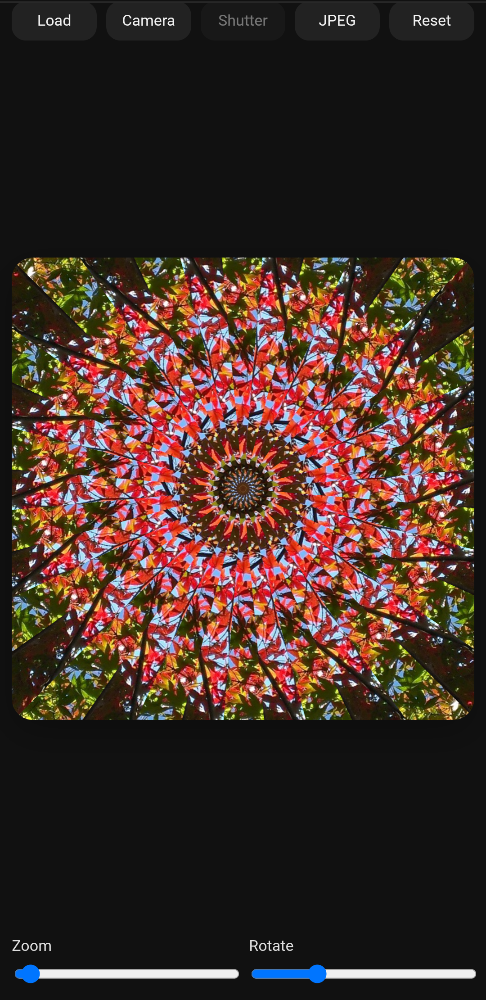

# KALEIDOSCOPE

画像やカメラを素材に、**リアルタイムで万華鏡パターンを生成するPWA**です。  
余計な設定を排除し、**すぐに美しい状態に入れること**を重視しています。

## 実行

https://masato-nasu.github.io/kaleidoscope/

## スクリーンショット

## 特徴

- **36分割固定**
- **画像 / カメラ両対応**
- **リアルタイム万華鏡表示**
- **1本指ドラッグで中心移動**
- **シンプルな操作系**
- **JPEG保存**
- **PWA対応（インストール可）**

## 主な機能

- **Load**
  - 画像を読み込んで万華鏡生成
- **Camera**
  - カメラ入力をそのまま万華鏡化
- **Shutter**
  - 現在のフレームを固定
- **Center Move**
  - 1本指ドラッグで中心位置を調整
- **Zoom**
  - 拡大縮小
- **Rotate**
  - 回転
- **Save (JPEG)**
  - そのまま画像として保存

## 操作方法

1. 画像を読み込む、またはカメラを起動
2. 指で中心を動かす
3. 必要ならズーム / 回転
4. JPEGとして保存

## PWAとして使う

### iPhone / iPad（Safari）
1. ページを開く
2. 共有ボタンを押す
3. **ホーム画面に追加**

### Android（Chrome）
1. ページを開く
2. メニューを開く
3. **アプリをインストール** または **ホーム画面に追加**

## メモ

KALEIDOSCOPE は、  
**画像を加工するというより、視覚的な現象を取り出すための道具**として設計しています。
